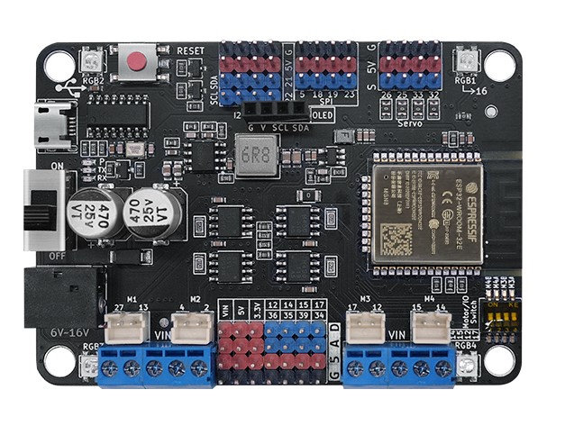

# Maker-ESP32 Board

## Product Image

## Introduction

The Maker-ESP32 is a high-performance controller developed by NULLLAB, based on the Espressif ESP32-WROOM-32E module. It is specifically engineered for Maker education, STEAM projects, and advanced robotics, combining powerful processing with heavy-duty motor driving capabilities.

## Key Features

1. Integrated High-Power Drive: Built-in Toshiba TB67H450FNG motor driver chip with a maximum current of 3.5A, eliminating the need for an external motor drive module.
2. Plug-and-Play Connectivity: Features dedicated PH2.0 motor ports and specialized headers for Servos, I2C, and SPI. No breadboards or messy jumper wires required.
3. Mechanical Compatibility: The PCB features M4 holes designed specifically for LEGO Technic integration, allowing for rapid structural prototyping.
4. Smart Feedback: 4 onboard integrated RGB LEDs provide immediate visual status indication.

## Technical Specifications

| Feature           | Details                                                      |
| ----------------- | ------------------------------------------------------------ |
| Core Module       | ESP32-WROOM-32E (Integrated 2.4 GHz Wi-Fi & Dual-mode Bluetooth) |
| Memory            | 448KB ROM, 520KB SRAM, 4MB Flash                             |
| Input Voltage     | DC 6V – 16V (Standard 5.5-2.1mm DC Jack)                     |
| Motor Driver      | Toshiba Professional Driver Chip                             |
| Max Current       | Up to 3.5A (Single Motor)                                    |
| Dimensions        | 80mm × 57mm (PCB Thickness: 1.6mm)                           |
| Weight            | 35g (Net)                                                    |
| Mounting          | M4 Holes, LEGO Compatible                                    |
| Motor Pin         | M1(27, 13) M2(4, 2) M3(17, 12) M4(14, 15)                    |
| Servo Pin         | 25, 26, 32, 33                                               |
| Stepper Motor Pin | Stepper Motor1(27, 13, 2, 4) Stepper Motor2(17, 12, 14, 15)  |

## Hardware Interface Map

[Click here to view the schematic](./maker-esp32.pdf)

[Click here to view the 3D model diagram](./maker-esp32.step)

The board is rich with specialized ports to minimize messy wiring.

**Notes:**   Motor and IO Switch:  When the switch is toggled to the "IO" side, the corresponding pins (17, 12, 14, 15) function as general-purpose input/output ports; when the switch is set to the "Motor" side (M3A/M3B/M4A/M4B), these pins switch to motor drive functionality.

### Motor Control

- 4 x DC Motor Ports (PH2.0 Interface).

- 2 x Stepper Motor Ports.

  **Notes:**  stepper1 shares the same IO pins with M1 and M2, and stepper2 shares pins with M3 and M4, so they cannot be used simultaneously. When using the motors, ensure the DC jack is powered externally (6-16V) and, if using the M3/M4 motors, set the toggle switch to the motor side.

### Actuators & Display

- 4 x Servo Interface (connected to GPIOs 25, 26, 32, 33).
- Dedicated OLED Interface (I2C).

### Expansion Ports

- 5 x I2C Header Interfaces.
- 1 x SPI Header Interface(5, 18, 19, 23).
- 8 x General IO Pins (12, 14, 15, 17, 34, 35, 36, 39).

### Onboard Visuals

- 4 x Programmable RGB LEDs (connected to GPIO 16).

## Examples(ESP32 Version >= 3.0.0)

[Click to download the motor sample program](https://github.com/nulllaborg/maker-esp32/releases/download/v1.0.0/motorTest.zip)

[Click here to download the RGB light sample program](https://github.com/nulllaborg/maker-esp32/releases/download/v1.0.0/rgbTest.zip)

[Click to download the servo sample program](https://github.com/nulllaborg/maker-esp32/releases/download/v1.0.0/servoTest.zip)

[Click to download the comprehensive sample program for motor servos](https://github.com/nulllaborg/maker-esp32/releases/download/v1.0.0/motorServotTest.zip)

[Click to download the stepper motor sample program](https://github.com/nulllaborg/maker-esp32/releases/download/v1.0.0/stepperTest.zip)

## Advanced Features & Critical Notes

### Motor and IO Switch (Multi-purpose Selector)

The board features a specialized DIP switch to toggle the function of the M3 and M4 ports

1. IO Position: The M3 and M4 motor ports are disabled. The associated pins act as standard General Purpose Input/Output (GPIO) ports for sensors.
2. Motor Position (M3A/M3B/M4A/M4B): Enables full motor driving capability for the M3 and M4 ports.

### Input/Output Restrictions (Hardware Constraints)

Due to the native architecture of the ESP32 chip, users must be aware of the following when using the Arduino framework

1. Input Only: Pins 34, 35, 36, and 39 can only be used as inputs. They cannot be configured as outputs.
2. No Internal Resistors: These specific pins (34, 35, 36, 39) do not support internal pull-up or pull-down modes. If using these for buttons or digital signals, external resistors are required.

## Software & Programming

Maker-ESP32 is cross-platform compatible, making it suitable for both beginners and advanced developers

- Arduino IDE: Use the ESP32 board manager to upload C++ code.
- MicroPython/Python: Ideal for rapid prototyping and AI-based logic.

## **Reference Links**

[ESP-IDF Programming Guide](https://docs.espressif.com/projects/esp-idf/en/latest/esp32/get-started/index.html)

[ESP-IDF Extension for VSCode - - — ESP-IDF Extension for VSCode latest documentation](https://docs.espressif.com/projects/vscode-esp-idf-extension/en/latest/index.html)

[MicroPython language and implementation — MicroPython latest documentation](https://docs.micropython.org/en/latest/reference/index.html)

[micropython/ports/esp32/README.md at master · micropython/micropython](https://github.com/micropython/micropython/blob/master/ports/esp32/README.md)

[Welcome to ESP32 Arduino Core’s documentation - - — Arduino ESP32 latest documentation](https://docs.espressif.com/projects/arduino-esp32/en/latest/index.html)
